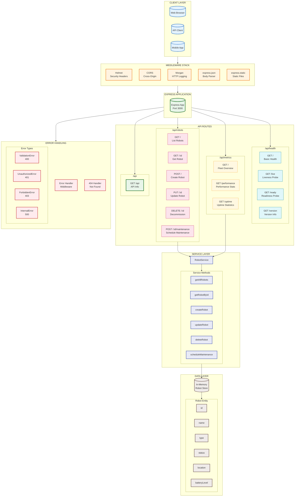
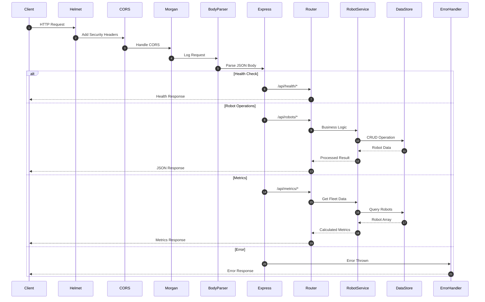
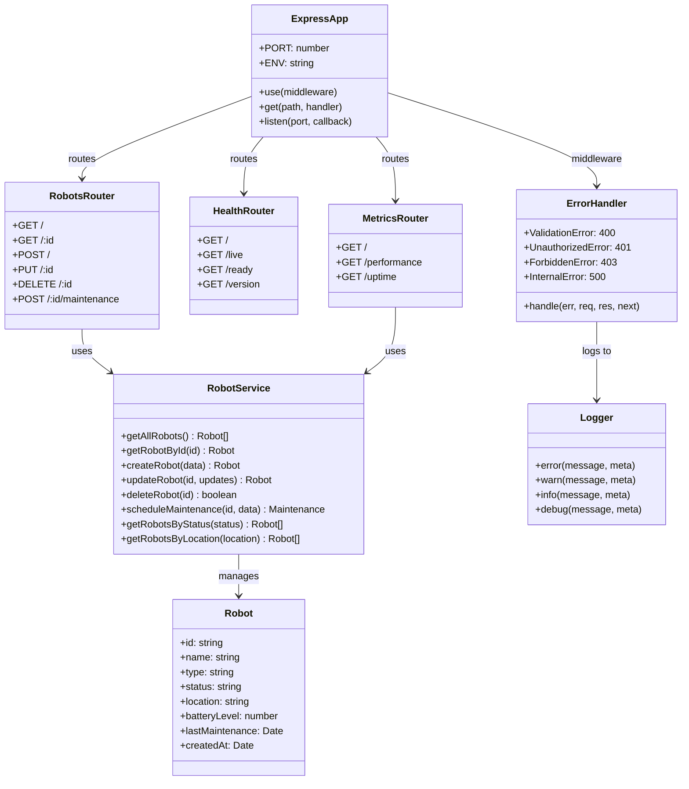
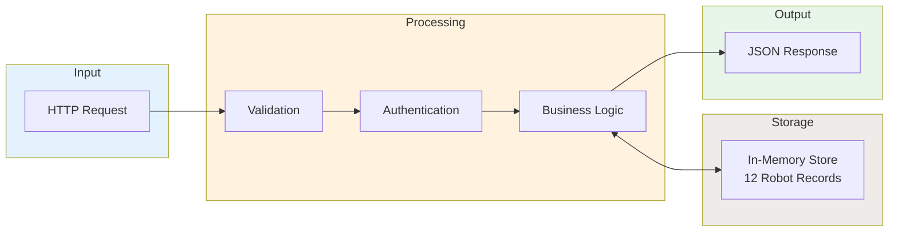

# Globomantics Robot Fleet API - Architecture Diagram

## Complete API Architecture

## Request Flow Sequence Diagram

## API Endpoints Reference

| Route | Method | Description | Handler |
|-------|--------|-------------|---------|
| `/api` | GET | API information | index.js |
| `/api/health` | GET | Basic health check | health.js |
| `/api/health/live` | GET | Kubernetes liveness probe | health.js |
| `/api/health/ready` | GET | Kubernetes readiness probe | health.js |
| `/api/health/version` | GET | Version information | health.js |
| `/api/robots` | GET | List all robots (with filters) | robots.js |
| `/api/robots/:id` | GET | Get specific robot | robots.js |
| `/api/robots` | POST | Create new robot | robots.js |
| `/api/robots/:id` | PUT | Update robot | robots.js |
| `/api/robots/:id` | DELETE | Decommission robot | robots.js |
| `/api/robots/:id/maintenance` | POST | Schedule maintenance | robots.js |
| `/api/metrics` | GET | Fleet overview metrics | metrics.js |
| `/api/metrics/performance` | GET | Performance statistics | metrics.js |
| `/api/metrics/uptime` | GET | Uptime statistics | metrics.js |

## Component Class Diagram

## Data Flow Diagram

