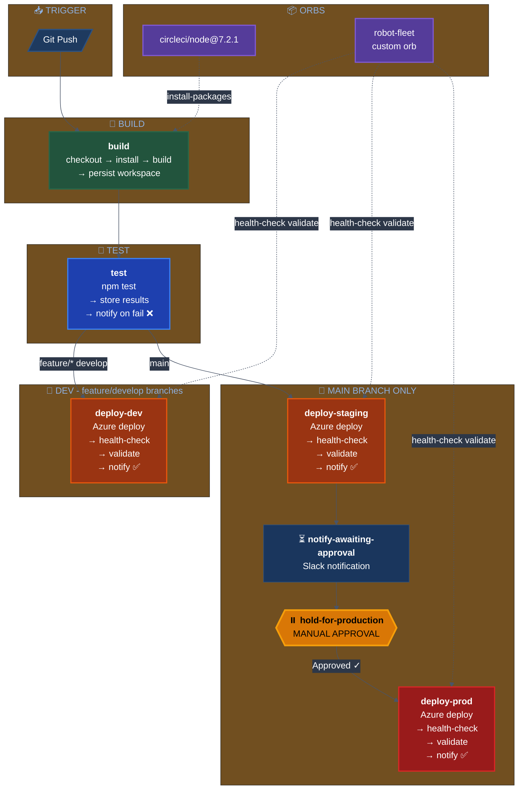

# CircleCI Pipeline Architecture

## Workflow Diagram



## Pipeline Flow Summary

### Branch: `feature/*` or `develop`
```
build → test → deploy-dev → ✅ Slack Success
                    ↓
              If test fails → ❌ Slack Failure (pipeline stops)
```

### Branch: `main`
```
build → test → deploy-staging → notify-awaiting-approval → ⏸️ APPROVAL → deploy-prod
                     ↓                    ↓                                    ↓
               ✅ Slack Success    ⏳ Slack "Awaiting"              ✅ Slack Success
```

## Orb Integration

| Orb | Source | Usage |
|-----|--------|-------|
| `circleci/node@7.2.1` | CircleCI Registry | `node/install-packages` in build job |
| `robot-fleet` (inline) | `orb-source/` | `health-check`, `validate-deployment` in deploy jobs |

## Contexts

| Context | Environment Variable | Purpose |
|---------|---------------------|---------|
| `slack-notifications` | `SLACK_WEBHOOK` | Slack webhook URL for notifications |

## Notifications

| Event | Color | Message |
|-------|-------|---------|
| Test Failure | 🔴 Red | "❌ Build Failed - Robot Fleet API" |
| Deploy Success | 🟢 Green | "✅ Deployed to {env} - Robot Fleet API" |
| Awaiting Approval | 🟡 Yellow | "⏳ Awaiting Production Approval" |
